# Cisco Cornerstone Lab - Multi-Site Campus and WAN Architecture

## Overview

This lab demonstrates a multi-site enterprise network built on Cisco IOS with a three-tier campus, redundant distribution and WAN edge paths, dynamic routing, encrypted branch connectivity, automated failover, and centralized network operations.

The focus is on how Layer 2 forwarding, first-hop redundancy, interior routing, WAN path selection, and monitoring operate together as one environment.

This lab is documented as a validated engineering case note, not a configuration walkthrough.

## Lab Objectives

- Build a three-tier access, distribution, and core architecture
- Segment user, guest, IT, server, and management traffic
- Align spanning tree root placement with HSRP gateway ownership
- Implement Layer 2 and Layer 3 LACP port-channels
- Run OSPF Area 0 across the campus backbone
- Establish route-based IPsec connectivity to a remote branch
- Exchange inter-site routes using eBGP
- Implement campus and WAN failover
- Centralize syslog collection and SNMPv3 monitoring
- Validate end-to-end campus-to-branch connectivity

---

## Topology

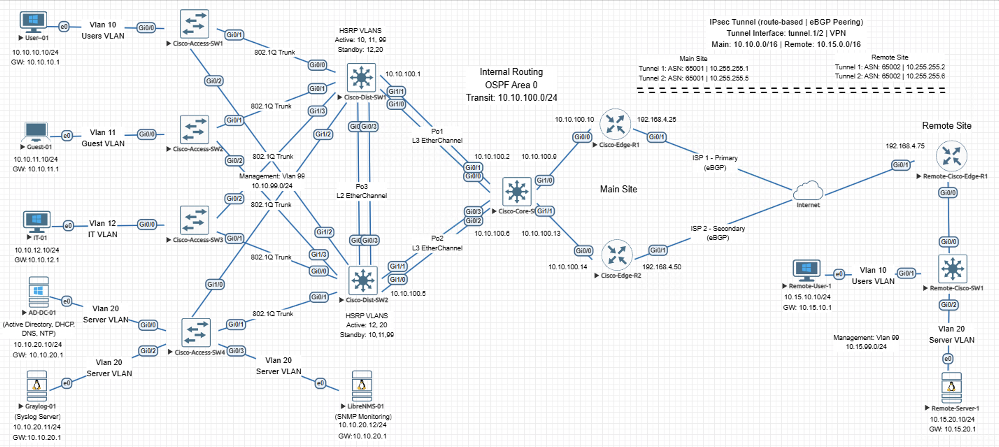

---

## Campus Architecture

Dedicated VLANs separate user, guest, IT, server, and management traffic, with each access switch carrying only the VLANs required for its role.

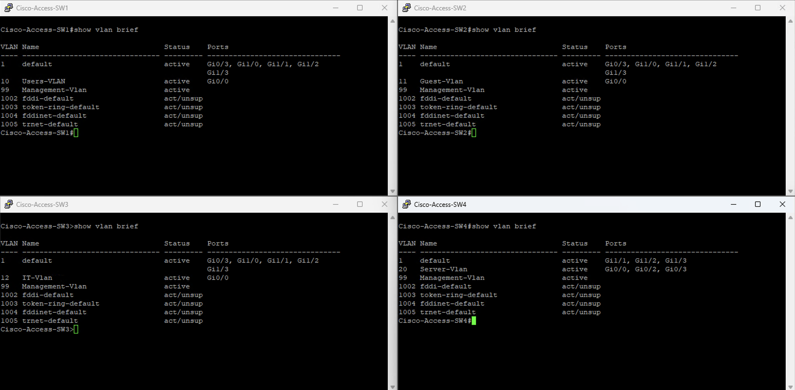

HSRP gateway ownership is aligned with Rapid-PVST root placement to maintain predictable forwarding across the distribution layer.

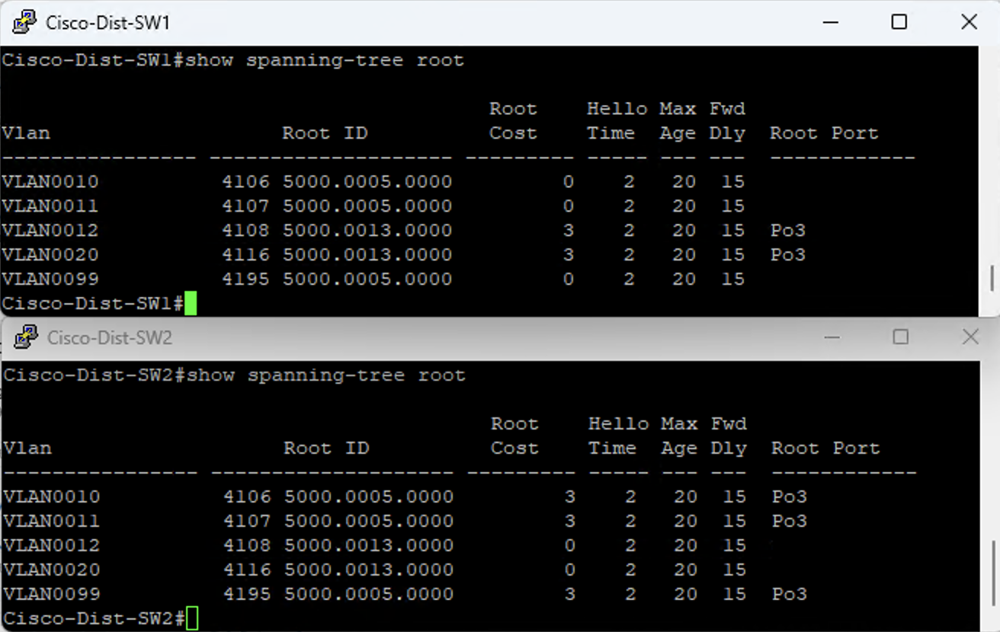

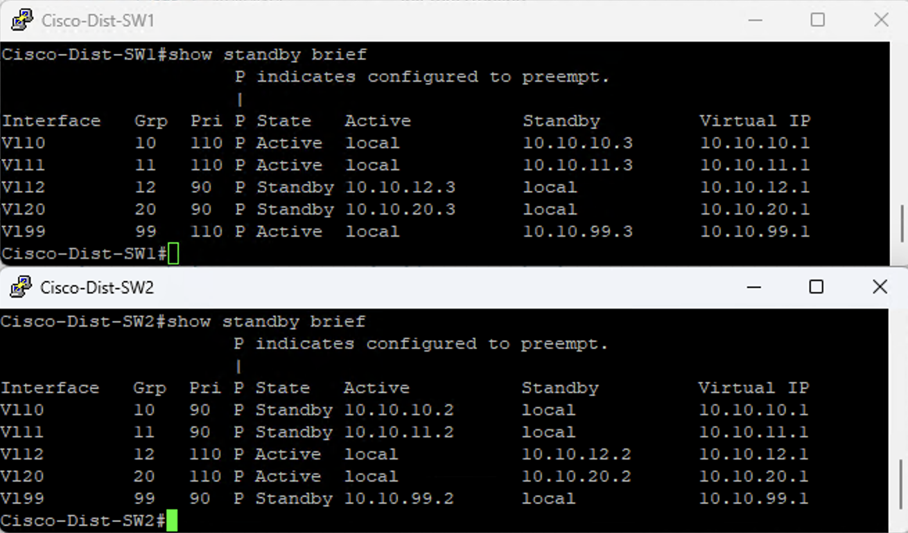

LACP provides Layer 2 aggregation between the distribution switches and Layer 3 aggregation toward the core.

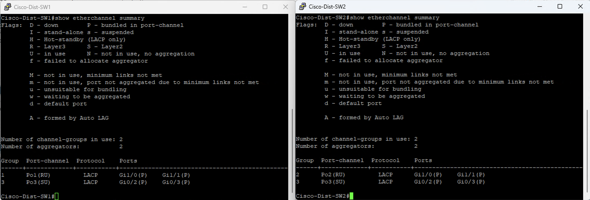

---

## Interior Routing

OSPF Area 0 provides campus routing, with preferred and backup distribution paths aligned to the STP and HSRP forwarding design.

Per-SVI OSPF cost tuning defines the preferred distribution path while preserving the peer as an alternate route.

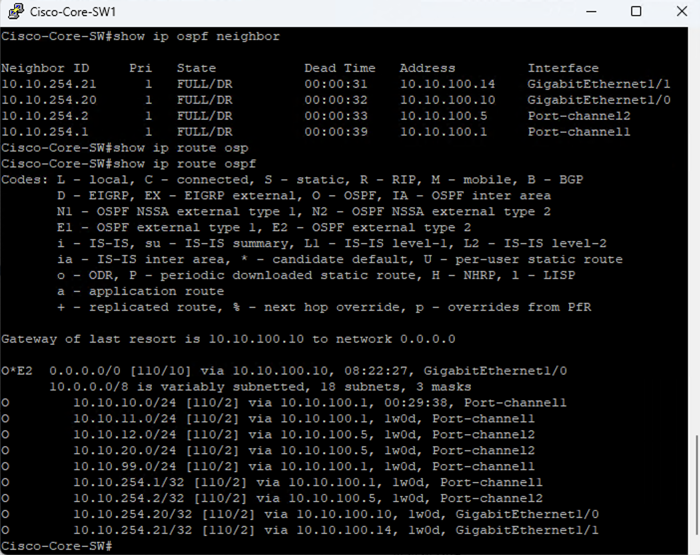

---

## Campus Distribution Failover

IP SLA-based HSRP tracking and OSPF backup paths provide coordinated gateway and routing failover when the preferred distribution uplink becomes unreachable.

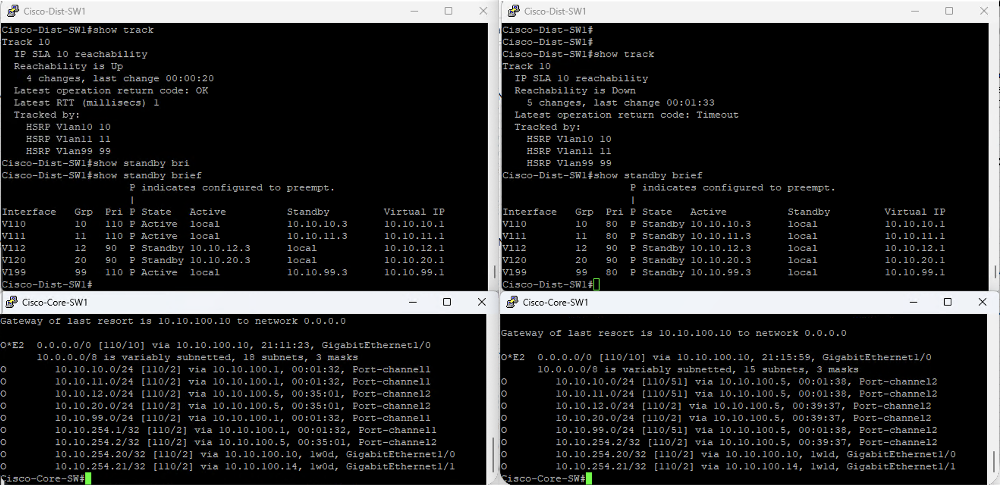

The IT and server VLANs remain on Cisco-Dist-SW2 because their preferred gateway and routing paths already reside on that switch.

---

## WAN and Branch Connectivity

Dual route-based IPsec tunnels provide encrypted connectivity to the remote site, with eBGP exchanging routes across both paths.

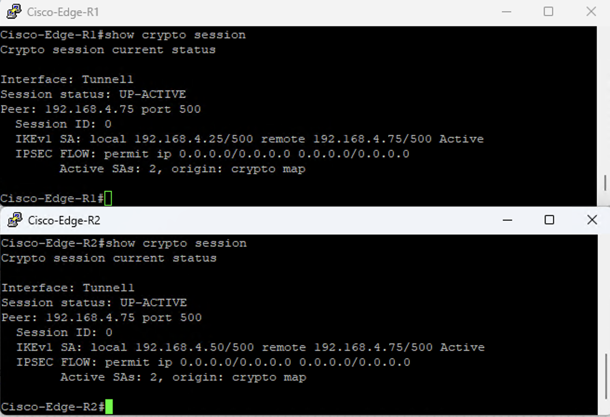

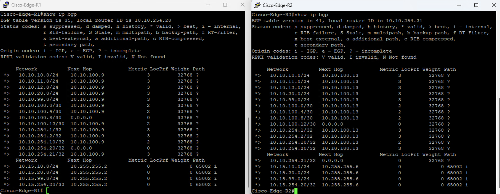

IP SLA and object tracking provide automatic primary-to-failover WAN path selection.

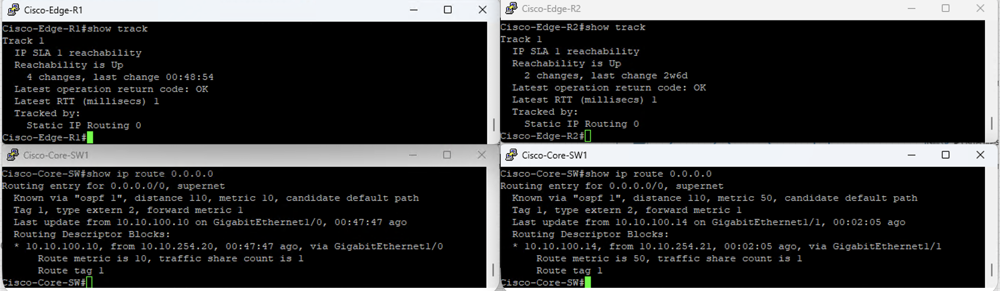

End-to-end testing confirms successful campus-to-branch forwarding across the routed and encrypted path.

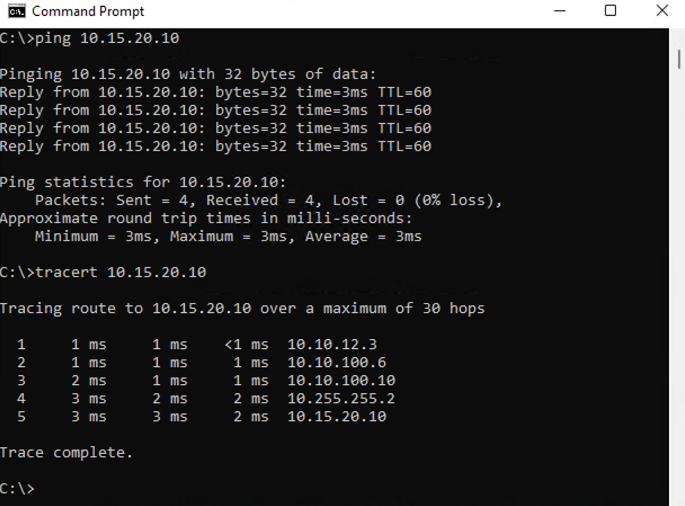

---

## Architecture Summary

### Campus

- Three-tier access, distribution, and core architecture
- Redundant distribution layer
- Dedicated functional VLANs
- Dual-homed access switches
- Rapid-PVST
- HSRP
- Layer 2 and Layer 3 LACP
- PortFast and BPDU Guard
- Dedicated management network

### Routing

- OSPF Area 0 across the campus backbone
- Full core adjacency with both distribution and WAN edge routers
- Per-SVI OSPF cost tuning for preferred and alternate distribution paths
- OSPF path preference aligned with STP and HSRP ownership
- Infrastructure loopbacks for stable routing identities
- Dynamically learned WAN default route
- eBGP for inter-site route exchange

### WAN

- Dual HQ edge routers
- Route-based IPsec
- Dual encrypted branch paths
- eBGP across both tunnels
- IP SLA and object tracking
- Primary and failover WAN routing
- NAT overload for internet-bound traffic
- Inter-site traffic excluded from internet NAT

### Operations

- Centralized Graylog syslog
- LibreNMS monitoring through SNMPv3
- Active Directory providing DNS, DHCP, and NTP
- SSH administration
- Centralized time synchronization

---

## Resiliency Behavior

- HSRP provides gateway failover between distribution switches
- OSPF maintains alternate Layer 3 paths through the peer distribution switch
- LACP preserves connectivity during individual member-link failure
- IP SLA-based HSRP tracking coordinates gateway ownership with distribution uplink reachability
- IP SLA and object tracking move the default path to the failover WAN edge when required
- Dual IPsec and eBGP paths provide redundant branch connectivity

---

## Operations and Monitoring

### Centralized Syslog

Graylog provides centralized visibility into infrastructure events, including interface changes, configuration activity, and tracking transitions.

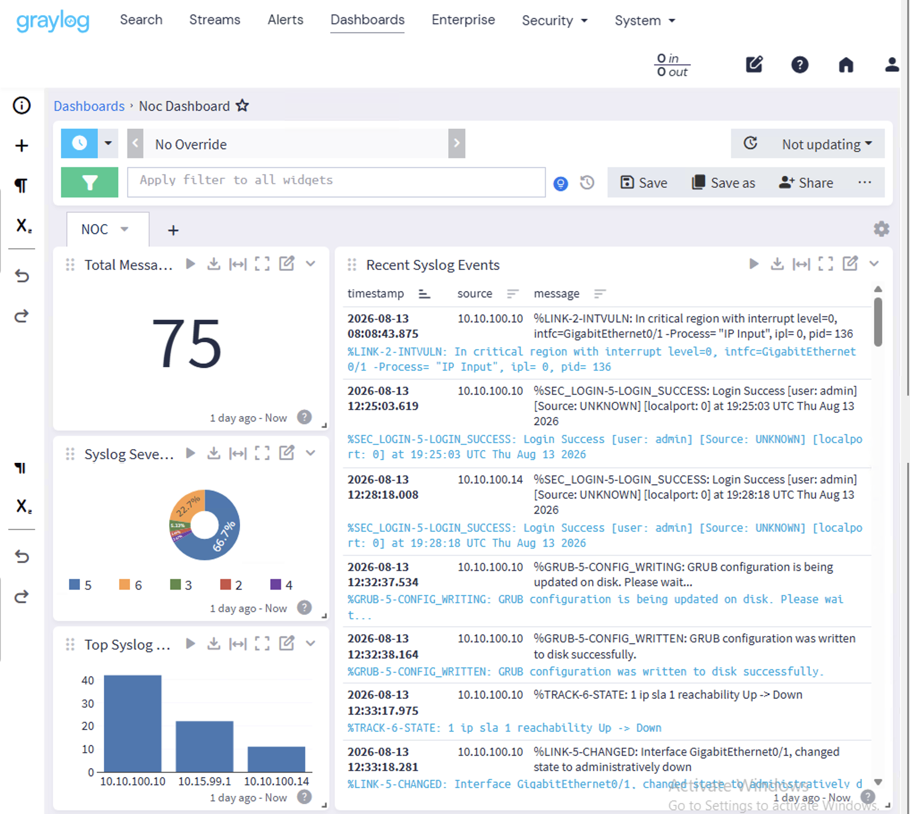

### SNMPv3 Monitoring

LibreNMS provides centralized device, interface, health, and routing protocol visibility across the campus and branch.

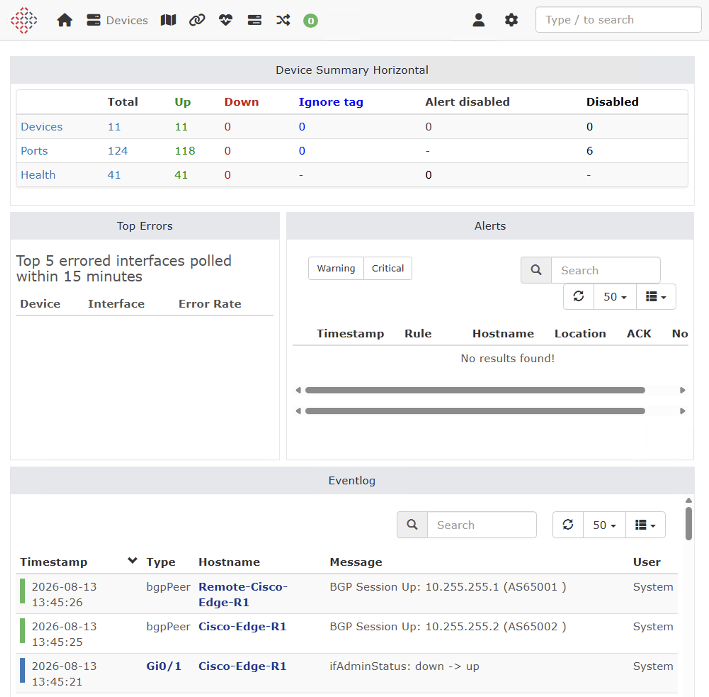

---

## Key Takeaways

Resilient design comes down to answering one question at every layer: when this fails, what takes over, and does the network already know? Spanning tree, HSRP, and OSPF each answer that separately. A campus where those answers do not line up can still reach every destination, which is exactly what makes the misalignment hard to catch. Consistency here was deliberate, with each VLAN having one distribution switch that is its root bridge, its active gateway, and its preferred path to the core.

Sizing matters as much as the mechanism. A tracking decrement has to move the active HSRP priority below the standby peer, and a backup OSPF path has to remain valid while carrying a higher cost than the preferred path. Get either wrong and the feature is configured, running, and doing nothing. That kind of mistake can survive a configuration review.

Testing is the only thing that separates a recovery design from a recovery claim. Two failures were introduced here on purpose, one at a distribution uplink and one at the WAN edge, and both moved to their alternates without manual intervention. Everything before those tests was reasoning about how the network should behave.

Logging and monitoring answer a question that live output cannot. A routing table shows what is installed now, not that a probe timed out, that a priority changed because of it, and that the routing path changed during the same failure event. Graylog and LibreNMS preserve that sequence, which allows a failure to be reconstructed rather than only witnessed.

All of it reduces to one thing: knowing where traffic goes before a failure and where it goes after. Redundancy alone leaves that unanswered. Defining, testing, and observing that transition is what makes the network operable by someone who did not build it.

---

## Lab Environment

- EVE-NG
- Cisco IOS routing and switching infrastructure
- Windows Server
  - Active Directory
  - DNS
  - DHCP
  - NTP
- Graylog
- LibreNMS
- Windows and Linux endpoints
